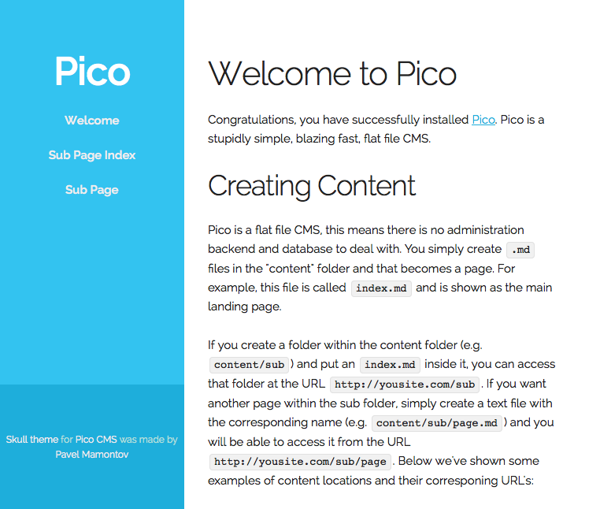
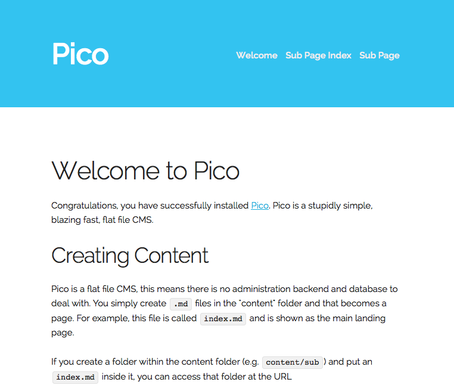
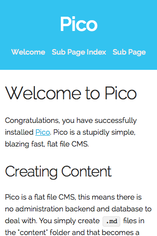

# Skull theme for Pico CMS

Skull is a basic [Pico](http://picocms.org) theme made utilizing the [Skeleton 2.0](http://getskeleton.com) responsive boilerplate. The theme is using stock Skeleton for the most part, with a few Pico-specific additions. 

Comes with two layouts; one with a vertical navigation, one with horizontal navigation.

# Installation

**1)** Clone the theme into your Pico theme directory.

<pre>
    cd /path/to/Pico/themes
    git clone https://github.com/bananana/skull
</pre>

**2)** Edit your *config.php* file and change <code>$config['theme']</code> to <code>$config['theme'] = 'skull'</code>.

**3)** By default the theme is set to have a vertical sidebar with navigation. To change to something that looks more like the default Pico theme (with horizontal header), rename *index.php* file to *index-v-nav.php* and rename *index-h-nav.php* to *index.php*.

<pre>
    cd /path/to/Pico/themes
    mv index.php index-v-nav.php
    mv index-h-nav.php index.php
</pre>

**4)** At this point you can remove the alt theme layout if you don't find in necessary. There's also a layout specific css file in *skull/css* direcotry.  

# Screenshots

**Vertical sidebar navigation**

- - -

**Horisontal header navigation**
 

- - -

**Mobile**

 

# To Do

- Make layout switching easier
